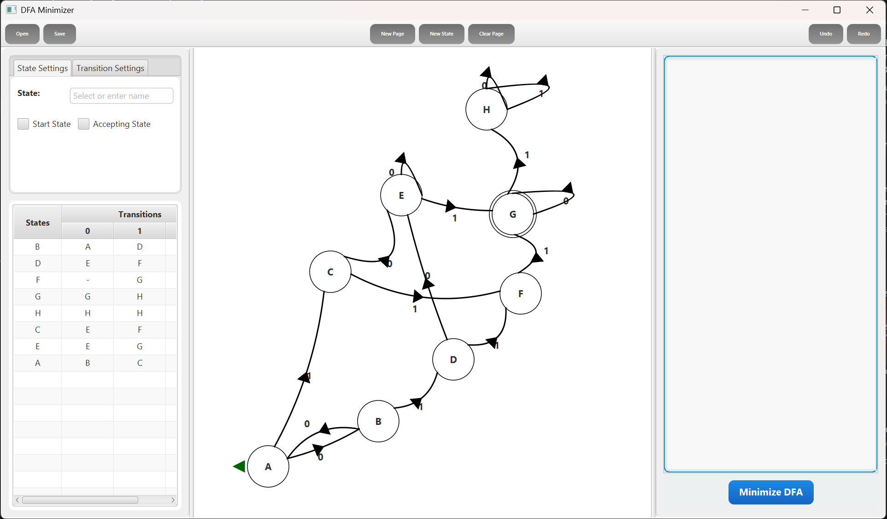
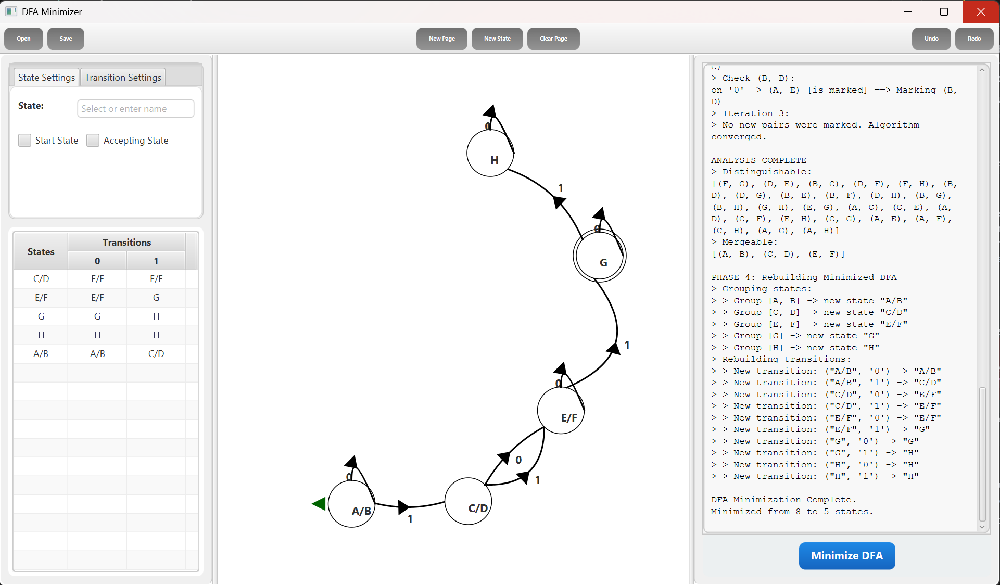
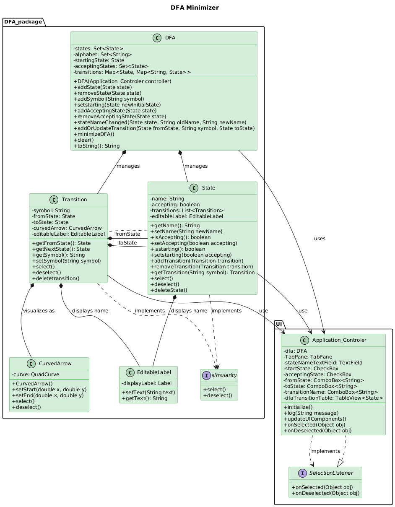

<!-- 
  SEO & METADATA STRATEGY:
  - Primary Keyword: "DFA Minimizer" (H1, Alt Text, Description)
  - Secondary Keywords: "JavaFX Automata Simulator", "Finite Automata Visualization", "Table-Filling Algorithm"
  - Visuals: Uses dynamic SVG generators for fresh content on every page load.
  - License: Assumed MIT based on "Open Source" intent; file generation scheduled for Phase 2.
-->

<div align="center">

<!-- HERO BANNER: Dynamic Capsule Render -->


<!-- TYPING SVG: Dynamic Value Propositions -->
<a href="https://github.com/Amkhodaei83/DFA-Minimizer">
  
</a>

<br />

<!-- BADGES: High-Value Signals -->
<!-- Note: Build Status badge links to a workflow we will create in Phase 2 -->
<a href="https://github.com/Amkhodaei83/DFA-Minimizer/actions">
  
</a>
<a href="https://github.com/Amkhodaei83/DFA-Minimizer/blob/main/LICENSE">
  
</a>
<a href="https://github.com/Amkhodaei83/DFA-Minimizer/releases">
  
</a>
<a href="https://www.java.com">
  
</a>
<a href="https://openjfx.io/">
  
</a>

<br />
<br />

<!-- ACTION BUTTONS -->
<a href="https://github.com/Amkhodaei83/DFA-Minimizer/releases/latest">
  <kbd>⬇️ Download JAR</kbd>
</a>
&nbsp;&nbsp;
<a href="#-getting-started">
  <kbd>⚡ Quick Start</kbd>
</a>

</div>

<br />

---

## 📖 Table of Contents


<details>
<summary><strong>Expand to view full navigation</strong></summary>


- [About The Project](#-about-the-project)
  - [Key Features](#key-features)
  - [Built With](#built-with)
- [Demo & Visuals](#-demo--visuals)
- [Architecture](#architecture)
- [Getting Started](#-getting-started)
  - [Prerequisites](#prerequisites)
  - [Installation](#installation)
- [Usage Guide](#-usage-guide)
  - [Creating Automata](#creating-automata)
  - [Minimization Process](#minimization-process)
- [Roadmap](#-roadmap)
- [Contributing](#-contributing)
- [License](#-license)
- [Contact](#-contact)

</details>

---

## 💡 About The Project

**DFA Minimizer** is a robust, interactive simulation platform designed to bridge the gap between abstract automata theory and visual understanding. Built for computer science students, educators, and language theory enthusiasts, this tool provides a hands-on environment to design, analyze, and optimize **Deterministic Finite Automata (DFA)**.

Unlike static textbook diagrams, DFA Minimizer offers a **dynamic canvas** where states and transitions come alive. Users can construct complex automata via drag-and-drop, configure transition logic with Bezier curves, and witness the mathematical rigor of the **Table-Filling Algorithm (Hopcroft’s/Moore’s logic derivative)** in real-time. The application logs every step of the minimization process—from identifying unreachable states to merging indistinguishable pairs—making it an essential debugging and learning companion.

### Key Features

*   **🎨 Interactive Vector Canvas:** Drag-and-drop state management with cubic Bezier curve transitions for complex graph layouts.
*   **📉 Algorithmic Minimization:** One-click execution of the table-filling algorithm to reduce DFAs to their most efficient form.
*   **🔍 Detailed Process Logging:** A transparent "console-like" log view that explains *why* states are merged or removed.
*   **📊 Real-Time Transition Table:** Automatically updates the formal definition ($Q, \Sigma, \delta, q_0, F$) as you draw.
*   **💾 State Persistence:** Save and load automata configurations (serialized graph data) to revisit complex problems.
*   **⚡ Modern JavaFX Stack:** Utilizes `ControlsFX` and `BootstrapFX` for a responsive, native-feeling UI.

### Built With

This project is engineered using a modern, modular Java ecosystem.

| Tech Stack | Description |
| :--- | :--- |
| [](https://openjdk.org/) | **Core Language:** Leveraging records, pattern matching, and modularity. |
| [](https://openjfx.io/) | **GUI Framework:** Hardware-accelerated graphics and FXML-based layouts. |
| [](https://maven.apache.org/) | **Build System:** Dependency management and lifecycle automation. |
| [](https://junit.org/junit5/) | **Testing:** Unit testing for state logic and minimization algorithms. |
| [](https://controlsfx.github.io/) | **UI Components:** Advanced controls and dialogs. |


## 📸 Demo & Visuals

Experience the **DFA Minimizer** in action. The interface is designed to provide immediate visual feedback as you manipulate automata states.

### Before & After Minimization

<div align="center">
  <table>
    <tr>
      <td align="center">
        <b>1. Designing the Automaton</b><br/>
        <em>Complex initial state with redundant transitions.</em><br/><br/>
        
      </td>
      <td align="center">
        <b>2. Minimized Result</b><br/>
        <em>Optimized output after applying the table-filling algorithm.</em><br/><br/>
        
      </td>
    </tr>
  </table>
</div>

### System Architecture

 The application strictly follows the **Model-View-Controller (MVC)** architectural pattern to ensure separation of concerns and maintainability.

<div align="center">
   
</div>

---

## 🚀 Getting Started

Follow these steps to set up the project locally. This application is built with **Java 21** and relies on **Maven** for dependency management.

### Prerequisites

*   **Java Development Kit (JDK) 21** or higher.
*   **Maven 3.8+** (or use the included `mvnw` wrapper).
*   **Git** for version control.

### Installation

1.  **Clone the repository**
    ```bash
    git clone https://github.com/Amkhodaei83/DFA-Minimizer.git
    cd DFA-Minimizer
    ```

2.  **Build the project**
    Use the Maven wrapper to ensure the correct version is used. This command cleans the target directory and packages the application into a JAR.
    ```bash
    ./mvnw clean package
    # On Windows, use: .\mvnw.cmd clean package
    ```

3.  **Run the application**
    You can run the app directly via the JavaFX Maven plugin:
    ```bash
    ./mvnw javafx:run
    ```
    
    *Alternatively, run the built JAR from the `target/` directory:*
    ```bash
    java -jar target/DFA_app-1.0-SNAPSHOT.jar
    ```

---

## 🎮 Usage Guide

The **DFA Minimizer** canvas is interactive. Master the controls to build automata efficiently.

### ⌨️ Controls & Shortcuts

| Action | Shortcut / Gesture | Description |
| :--- | :--- | :--- |
| **New State** | <kbd>Ctrl</kbd> + <kbd>N</kbd> | Enters "State Placement Mode". Click anywhere on the canvas to drop a new state. |
| **Add Transition** | <kbd>Ctrl</kbd> + **Drag** | Hold <kbd>Ctrl</kbd>, click a source state, and drag to a target state to create a connection. |
| **Minimize DFA** | <kbd>Ctrl</kbd> + <kbd>R</kbd> | Triggers the minimization algorithm. Watch the log panel for step-by-step details. |
| **Delete Item** | <kbd>Ctrl</kbd> + <kbd>D</kbd> | Removes the currently selected state or transition. |
| **Edit Label** | **Double Click** | Edit the name of a state or the symbol of a transition. |
| **Context Menu** | **Right Click** | Selects an object (State/Transition) for property editing in the left panel. |

### 🛠️ Core Workflow

1.  **Define States:**
    *   Use the **New State** button or shortcut.
    *   Select a state to toggle its properties: **Initial** (Green Arrow) or **Accepting** (Double Circle).
    
2.  **Create Transitions:**
    *   Connect states using the drag gesture.
    *   **Curved Lines:** The application uses Bezier curves automatically. Drag the control point (red handle) to adjust the curve's arc.
    *   **Symbols:** Ensure every transition has a defined symbol from your alphabet.

3.  **Execute Minimization:**
    *   Click **Start Process** (or <kbd>Ctrl</kbd> + <kbd>R</kbd>).
    *   The application will:
        1.  Identify and remove unreachable states.
        2.  Group indistinguishable states using the table-filling method.
        3.  Re-render the optimized DFA on the canvas.
    *   *Check the log panel on the right for a mathematical breakdown of the process.*


---

## 🔮 Roadmap

We are actively working to expand the capabilities of DFA Minimizer. Current development goals include:

- [x] **Core Minimization Engine** (Table-Filling Algorithm)
- [x] **Interactive Canvas** (Draggable states, Bezier curves)
- [x] **Basic Persistence** (Save/Load DFA structure)
- [ ] **Undo/Redo Stack** — Full history management for all canvas actions.
- [ ] **NFA Support** — Native support for Non-Deterministic Finite Automata and NFA-to-DFA conversion.
- [ ] **Step-by-Step Animation** — Visualizing the token consumption process on the graph.
- [ ] **Export Options** — Export diagrams to PNG, SVG, or LaTeX (TikZ).
- [ ] **Regex Integration** — Convert Regular Expressions directly to DFAs.

See the [open issues](https://github.com/Amkhodaei83/DFA-Minimizer/issues) for a full list of proposed features (and known bugs).

---

## 🤝 Contributing

Contributions are what make the open-source community such an amazing place to learn, inspire, and create. Any contributions you make are **greatly appreciated**.

### Workflow

1.  **Fork the Project**
2.  **Create your Feature Branch** (`git checkout -b feature/AmazingFeature`)
3.  **Commit your Changes** (`git commit -m 'Add some AmazingFeature'`)
4.  **Push to the Branch** (`git push origin feature/AmazingFeature`)
5.  **Open a Pull Request**

### Development Setup

The project uses standard Maven directory structures. 
- **Controller Logic:** Located in `src/main/java/com/example/dfa_app/Application_Controler.java`.
- **DFA Logic:** Located in `src/main/java/com/example/dfa_app/DFA/`.
- **Styles:** Modify `src/main/resources/com/example/dfa_app/styles2.css` for UI theming.

*Please ensure all new logic includes corresponding JUnit tests where applicable.*

---

## 📝 License

Distributed under the **MIT License**. See `LICENSE` for more information.

---

## 📧 Contact & Acknowledgments

**Project Maintainer:** [Amkhodaei83](https://github.com/Amkhodaei83)

### Acknowledgments

*   **[ControlsFX](https://github.com/controlsfx/controlsfx)** — For the advanced JavaFX UI components.
*   **[BootstrapFX](https://github.com/kordamp/bootstrapfx)** — For the modern look and feel.
*   **Hopcroft, Motwani, & Ullman** — For the foundational automata theory concepts utilized in this tool.
*   **Capsule Render** — For the dynamic header art.


<div align="center">
  
</div>
=======
# DFA Minimizer

An interactive JavaFX application for creating, visualizing, and minimizing Deterministic Finite Automata (DFAs). This tool is designed as an educational resource for students, computer scientists, and educators to understand the principles of automata theory through a hands-on, graphical interface.

This application allows users to:

- Create and edit DFAs through an intuitive graphical canvas.
- Visualize DFA structure and transitions in real-time.
- Automatically minimize DFAs using a table-filling algorithm.
- Learn from a detailed log of the entire minimization process.

## Features

- **Interactive Canvas:** A user-friendly drag-and-drop interface to create and arrange DFA states and transitions.
- **Visual State Management:** Add, rename, delete, and reposition states. Designate states as initial or accepting with simple checkbox controls.
- **Intuitive Transition Editing:** Create transitions between states with a `Ctrl+Click` gesture. Edit transition symbols and adjust the curvature of transition arrows for clarity.
- **Real-time Transition Table:** The application automatically generates and updates a transition table that reflects the current state of the DFA on the canvas.
- **One-Click DFA Minimization:** Implements the table-filling algorithm to minimize the DFA by removing unreachable states and merging indistinguishable states.
- **Detailed Process Logging:** The minimization process is fully logged, showing each step from identifying unreachable states to marking distinguishable pairs and grouping mergeable states.

## Screenshots

**1. Designing a complex DFA (Initial State).**


**2. The resulting minimized DFA and the detailed process log.**


## Installation Instructions

### Prerequisites

- Java Development Kit (JDK) 11 or higher
- Maven (for building from source)

### Running the Application

#### From GitHub Releases (Recommended)

1. Go to the [Releases page](https://github.com/Amkhodaei83/DFA/releases) of this repository.
2. Download the latest `DFA_app.zip` file.
3. extract the file.
4. run the `run.bat` file.

#### Building and Running from Source

1. **Clone the repository:**
   
   ```bash
   git clone https://github.com/Amkhodaei83/DFA.git
   cd DFA
   ```

2. **Build with Maven:**
   
   ```bash
   mvn clean install
   ```
   
   This will create the runnable JAR file in the `target/` directory.

3. **Run the application from source build:**
   
   ```bash
   java -jar target/DFA_app-1.0-SNAPSHOT.jar
   ```

## Usage Guide

### Creating a DFA

1. **Add a State**: Click the "New State" button or press `Ctrl+N`, then click on the canvas to place a state.
2. **Set State Properties**: Select a state to open the **State Settings** panel. Here you can:
   - Name the state.
   - Set it as the initial state.
   - Set it as an accepting state.
3. **Add a Transition**:
   - Hold `Ctrl` and `Primary Click` on the source state.
   - Drag your cursor to the destination state and release.
   - Select the new transition to edit its symbol.

### Minimizing a DFA

1. Ensure your DFA is complete (i.e., every state has an outgoing transition for each symbol in the alphabet).
2. Press the **Minimize DFA** button or press `Ctrl+R`.
3. The application will automatically remove unreachable states, group equivalent states, and display the minimized DFA on the canvas.

### Keyboard Shortcuts

- **`Ctrl+N`**: Create a new state.
- **`Ctrl+R`**: Minimize the DFA.
- **`Ctrl+D`** or **`Delete`**: Remove the selected state or transition.

## Code Architecture

The application follows the Model-View-Controller (MVC) design pattern:

- **Model**:
  
  - `DFA`: The core class representing the automaton, its states, alphabet, and transitions. Contains the minimization logic.
  - `State`: Represents an individual state with properties (name, initial, accepting) and its outgoing transitions.
  - `Transition`: Manages a connection from a source state to a destination state for a given symbol.

- **View**:
  
  - `Main_DFA.fxml`: Defines the layout and components of the user interface.
  - `styles2.css`: Provides the styling for a consistent and modern appearance.
  - Custom visual nodes (`State.java`, `Transition.java`, `CurvedArrow.java`) render the DFA on the canvas.

- **Controller**:
  
  - `Application_Controler.java`: Manages all UI interactions, handles user input, and coordinates updates between the model (DFA) and the view (canvas and settings panels).
  
  
  


## Contributing

Contributions are welcome!

## Future Enhancements

- Undo/redo functionality for all operations.
- Save/load DFAs to and from a custom file format.
- Animation of DFA execution on input strings.
- Support for Non-deterministic Finite Automata (NFAs) and NFA-to-DFA conversion.
- Export the canvas as an image (PNG, SVG).

## License

This project is licensed under the MIT License - see the `LICENSE` file for details.

## Acknowledgments

- Built with **JavaFX** for the graphical user interface.
- Inspired by concepts from formal language and automata theory.
